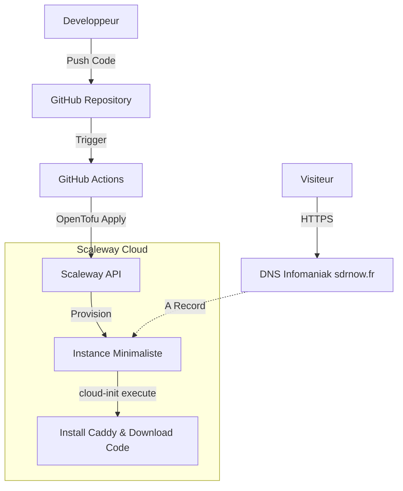

# Architecture Spine — Infrastructure Landing Page SDRnow

## Design Paradigm

**Immutable Static Server**
L'infrastructure est conçue comme éphémère et jetable. Le serveur web n'a pas d'état persistant (stateless). À chaque mise à jour (via CI/CD), OpenTofu détruit et recrée l'instance (ou `cloud-init` met à jour les fichiers en place), garantissant une reproductibilité totale. Les fichiers HTML/CSS sont la seule source de vérité.

## Invariants & Rules

### AD-1 — Pas de sur-ingénierie (Direct Packages)
- **Binds:** CAP-1, CAP-2
- **Prevents:** Consommation excessive de ressources (RAM/CPU) sur la plus petite instance Scaleway, complexité inutile.
- **Rule:** L'instance ne doit pas utiliser Docker. L'installation du serveur web et la copie des fichiers doivent se faire nativement sur l'OS via `cloud-init`.

### AD-2 — Caddy comme Serveur Web par défaut
- **Binds:** CAP-1
- **Prevents:** Complexité de gestion manuelle des certificats HTTPS (certbot, Let's Encrypt cron jobs).
- **Rule:** Le serveur web déployé doit être Caddy (ou équivalent avec HTTPS automatique natif) configuré avec le domaine `sdrnow.fr`.

### AD-3 — Déploiement "Zero-Touch"
- **Binds:** CAP-2
- **Prevents:** Dérive de configuration entre le code et l'infrastructure ("ClickOps" dans la console Scaleway).
- **Rule:** Aucune modification manuelle sur le serveur n'est autorisée. Tout changement (fichiers web ou configuration serveur) doit être commité sur GitHub pour déclencher le pipeline OpenTofu.

## Stack

| Name | Version |
| --- | --- |
| Scaleway Instance | Stardust ou Play2 (Ubuntu/Debian latest) |
| Serveur Web | Caddy |
| IaC | OpenTofu (latest) |
| CI/CD | GitHub Actions |

## Structural Seed

**Deployment & Environments Topology**



**Minimal Source Tree**
```text
/
  .github/workflows/   # Pipeline CI/CD (tofu apply)
  infra/               # Fichiers OpenTofu (.tf) et template cloud-init (.yaml)
  public/              # Fichiers statiques du site (HTML, CSS, assets)
```

## Capability → Architecture Map

| Capability / Area | Lives in | Governed by |
| --- | --- | --- |
| CAP-1 (Servir le site HTTPS) | `infra/cloud-init.yaml` | AD-1, AD-2 |
| CAP-2 (CI/CD Automatique) | `.github/workflows/` & `infra/main.tf` | AD-3 |

## Deferred

- **Monitoring & Alerting :** Pas de monitoring avancé (Datadog/Prometheus) prévu à ce stade pour des raisons de coût. Une simple vérification HTTP uptime (ex: UptimeRobot) suffira dans un premier temps.
- **Gestion du State OpenTofu :** Peut être stocké temporairement en local dans l'Action, ou dans le stockage S3 compatible de Scaleway si nécessaire (à configurer au moment du build).
